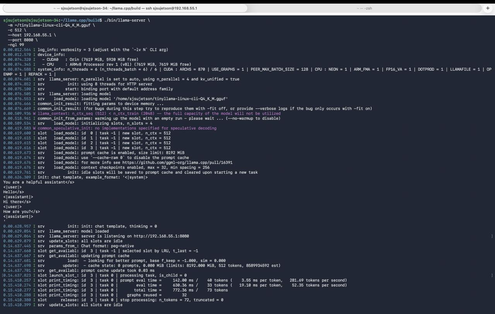
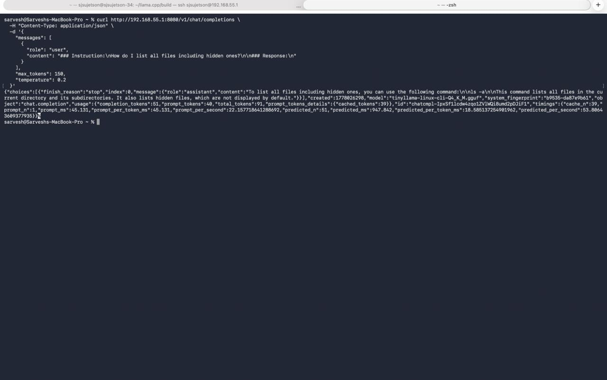

# Jetson Orin Nano — Edge LLM Inference Microservice

QLoRA fine-tuned TinyLlama-1.1B, quantized to 4-bit GGUF, and served as a CUDA-accelerated OpenAI-compatible REST API on an NVIDIA Jetson Orin Nano. The Jetson operates as a fully self-contained inference node — no cloud dependency, no internet required at runtime.

The host machine connects over a virtual Ethernet link via USB-C (`192.168.55.1`) and queries the model through a local HTTP endpoint.

---

## System Architecture

| Component | Detail |
|---|---|
| Base Model | TinyLlama-1.1B-Chat-v1.0 |
| Fine-Tuning | QLoRA (r=16, alpha=32) on CodeAlpaca-20k (1k examples), 3 epochs, T4 GPU |
| Quantization | GGUF Q4_K_M — ~700MB on disk |
| Edge Hardware | NVIDIA Jetson Orin Nano 8GB (Ampere SM8.7, unified LPDDR5 memory) |
| Inference Engine | `llama.cpp` compiled natively with `LLAMA_CUDA=1` |
| API | OpenAI-compatible `/v1/completions` REST endpoint |
| Interconnect | Virtual Ethernet over USB-C (`192.168.55.1`) |
| Client | macOS / Linux host |

---

## Repository Structure

```text
jetson-cli-assistant/
├── notebooks/
│   └── tinyllama_finetuning.ipynb  # QLoRA training: dataset prep → LoRA attach → SFT → adapter export
├── scripts/
│   ├── setup_jetson.sh             # Extracts llama.cpp bundle, compiles with CUDA on-device
│   └── start_server.sh             # Stops gdm3 (~1GB VRAM reclaim), launches llama-server
├── client/
│   ├── test_api.py                 # Python client — POST to /v1/completions, stream response
│   └── test_api.sh                 # cURL equivalent for rapid endpoint verification
└── images/
    ├── server_logs.jpg             # llama.cpp server init output on Jetson
    └── api_response.jpg            # JSON response received on host Mac
```

---

## Training Pipeline (Google Colab, T4)

**Dataset:** `sahil2801/CodeAlpaca-20k`, first 1,000 examples — instruction/response pairs formatted to Alpaca prompt template.

**Fine-tuning stack:**
- `transformers` + `peft` + `trl` (SFTTrainer + SFTConfig)
- 4-bit NF4 quantization via `bitsandbytes` for base model load (`bnb_4bit_quant_type=nf4`, `compute_dtype=float16`)
- LoRA adapters on `q_proj`, `k_proj`, `v_proj`, `o_proj` — 4.5M trainable params out of 1.1B (0.41%)
- Optimizer: `paged_adamw_8bit`, cosine LR decay, `lr=2e-4`, effective batch size 16 (4 × grad accum 4)
- Training time: ~7 minutes / 189 steps / 3 epochs

**Loss curve:** 1.26 → 0.66 (converged, no divergence)

**Output:** `adapter_model.safetensors` — merged with base weights post-training, then converted to GGUF Q4_K_M via `llama.cpp/convert_hf_to_gguf.py` + `llama-quantize`.

---

## Deployment Guide

### Phase 1 — Host Machine Preparation

The Jetson has no direct internet access at runtime. Pre-bundle all dependencies on the host.

```bash
# Clone this repo and the inference engine
git clone https://github.com/Sarves1911/jetson-cli-assistant
git clone https://github.com/ggerganov/llama.cpp
tar -czvf llama_cpp.tar.gz llama.cpp/

# Transfer bundle + GGUF model over USB-C link
scp llama_cpp.tar.gz sjsujetson@192.168.55.1:~/
scp tinyllama-linux-cli-Q4_K_M.gguf sjsujetson@192.168.55.1:~/
```

### Phase 2 — On-Device Compilation (Jetson Orin Nano)

```bash
ssh sjsujetson@192.168.55.1

# Compile llama.cpp with CUDA backend — targets Ampere (SM8.7)
chmod +x scripts/setup_jetson.sh && ./scripts/setup_jetson.sh

# Kill display manager to reclaim ~1GB unified memory, then start server
chmod +x scripts/start_server.sh && ./scripts/start_server.sh
```

`start_server.sh` stops `gdm3`, sets `LLAMA_CUDA=1`, and launches `llama-server` with full GPU layer offload.

### Phase 3 — Query the API (Host Machine)

```bash
# Python client
pip install requests
python client/test_api.py

# Or raw cURL
chmod +x client/test_api.sh && ./client/test_api.sh
```

The endpoint accepts standard OpenAI-format payloads at `http://192.168.55.1:8080/v1/completions`.

---

## Inference Benchmarks (Jetson Orin Nano 8GB)

| Metric | Value |
|---|---|
| Prompt Processing (prefill) | ~280 tokens/sec |
| Token Generation (decode) | ~50 tokens/sec |
| Model Size on Disk | ~700MB (Q4_K_M) |
| GPU Layers Offloaded | Full (Ampere CUDA) |

### Verification

Microservice initializing on the Jetson:



API response received on host Mac:

